<a id="readme-top"></a>

[![author][author-shield]][author-url]
# AI Engineer Portfolio

[](https://www.python.org/)
[](https://www.langchain.com/)
[](https://ollama.com/)
[](https://www.trychroma.com/)
[](https://docs.ragas.io/)
[](https://smith.langchain.com/)
[](https://pytorch.org)
[](https://huggingface.co/)
[](https://github.com/OtnielGomes/Data_Science_Portfolio/blob/main/LICENSE)
[](https://linkedin.com/in/otnielgomes)

<br />
<div align="center">
  <a href="https://github.com/OtnielGomes/Portifolio--AI-Engineering--Data-Science">
    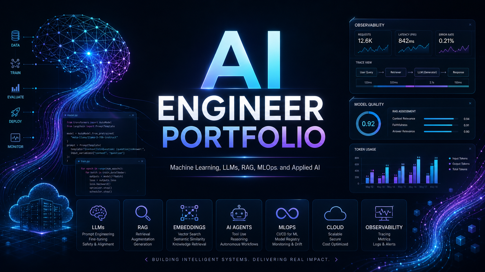
  </a>

<h1 align="center">Welcome to my AI Engineer Portfolio!</h1>
</div>

👋 Hi! I'm an AI Engineer focused on **LLMs, RAG pipelines, AI Agents and LLMOps**.
I build and evaluate intelligent systems that combine language models, retrieval strategies, and observability tooling to solve real-world problems with measurable results.

🔎 **Core Skills:**

🤖 LLM Application Development

🗂️ RAG Pipelines (Naive, HyDE, Reranking)

🧠 AI Agents & Prompt Engineering

📊 LLM Evaluation (BLEU, ROUGE, LLM-as-Judge, RAGAS)

🔍 LLMOps & Observability (LangSmith, tracing, metrics)

📁 Data Engineering & Modeling

🗄️ Big Data

💡 I'm looking for **opportunities and collaborations in AI Engineering, LLM Systems, and applied Generative AI**, where I can **build, evaluate, and ship intelligent systems that create real impact**.

---

<!-- TABLE OF CONTENTS -->
<details>
  <summary>Table of Contents</summary>
  <ol>
    <li><a href="#ai-engineer-portfolio">AI Engineer Portfolio</a></li>
    <li>
      <a href="#the-projects">The Projects</a>
      <ul>
        <li><a href="#llm-eval-suite">LLM-Eval-Suite</a></li>
        <li><a href="#llms---document-rag-agent">LLMs - Document RAG Agent</a></li>
        <li><a href="#classification---credit-card-churn-prediction">Classification - Credit Card Churn Prediction</a></li>
        <li><a href="#classification---credit-risk-classification">Classification - Credit Risk Classification</a></li>
        <li><a href="#clustering-project">Clustering Project</a></li>
      </ul>
    </li>
    <li><a href="#contributing">Contributing</a></li>
    <li><a href="#license">License</a></li>
    <li><a href="#contact">Contact</a></li>
  </ol>
</details>

<br />

## The Projects of AI Engineering:

<br/>

---

## LLM-Eval-Suite 🧪

#### Project complete: [Click here to check the complete project](https://github.com/OtnielGomes/LLM-Eval-Suite)

---

<div align="center">
  <a href="https://github.com/OtnielGomes/LLM-Eval-Suite">
    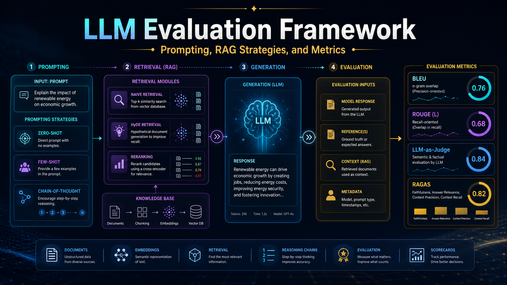
  </a>
</div>

---

### 📃 Project Description

A framework for benchmarking Large Language Models using **prompting strategies** (Zero-Shot, Few-Shot, Chain-of-Thought) and **RAG retrieval strategies** (Naive, HyDE, Reranking), with evaluation metrics from BLEU, ROUGE, LLM-as-Judge, and RAGAS.

The project uses a **hybrid inference architecture**: Ollama Cloud for generation and judging, Ollama Local for embeddings, and ChromaDB as the vector store. All runs are traced via **LangSmith**.

---

### 🏗️ Architecture

| Component | Backend | Model | Purpose |
|---|---|---|---|
| Generation | Ollama Cloud | Configurable via `.env` | Answer generation |
| Embeddings | Ollama Local | `nomic-embed-text` | Document & query embeddings |
| Judge | Ollama Cloud | Configurable via `.env` | LLM-as-Judge scoring |
| Vector Store | Local | ChromaDB | Document retrieval |

---

### 📊 Benchmark Results — Accuracy

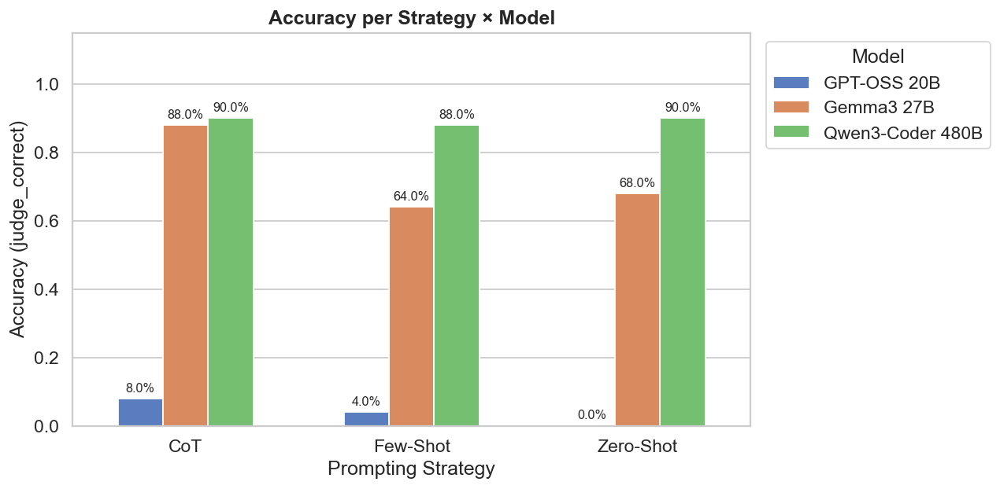

| Model | Zero-Shot | Few-Shot | CoT | Mean |
|---|---|---|---|---|
| **Qwen3-Coder 480B** | 90% | 88% | 90% | **89.3%** |
| Gemma3 27B | 68% | 64% | 88% | 73.3% |
| GPT-OSS 20B | 0% | 4% | 8% | 4% |

---

### 📊 RAG Results — Composite RAGAS Score

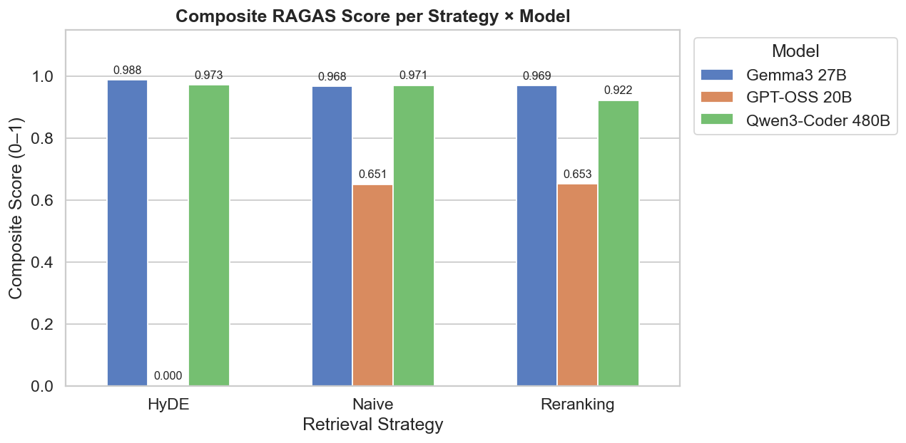

| Model | Naive | HyDE | Reranking | Mean |
|---|---|---|---|---|
| **Gemma3 27B** | 0.968 | **0.988** | 0.969 | **0.975** |
| Qwen3-Coder 480B | 0.971 | 0.973 | 0.922 | 0.955 |
| GPT-OSS 20B | 0.651 | 0.000 | 0.653 | 0.435 |

<p align="right">(<a href="#readme-top">back to top</a>)</p>

<br/>
<br/>

---

## LLMs - Document RAG Agent 🗂️

#### Project complete: [Click here to check the complete project](https://github.com/OtnielGomes/Document-Rag-Agent)

---

<div align="center">
  <a href="https://github.com/OtnielGomes/Portifolio--AI-Engineering--Data-Science">
    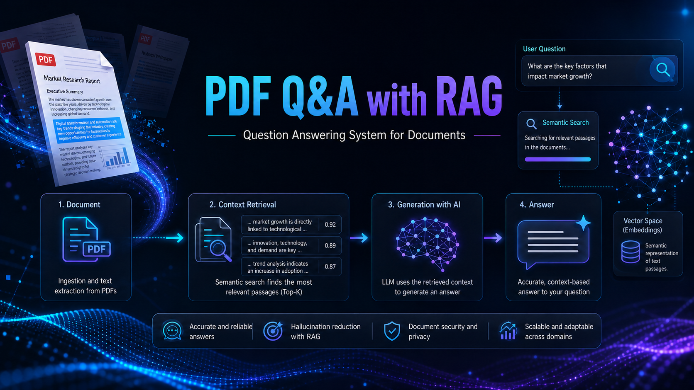
  </a>
</div>

---

### 📃 Project Description

#### RAG-Based Question Answering System

I developed a question answering system for **PDF** documents using **RAG (Retrieval-Augmented Generation)**, with a focus on retrieving relevant content snippets and generating more accurate answers based on the document context.

The project was built with **Python**, **Streamlit**, **LangChain**, **ChromaDB**, and **PyMuPDF**, including document ingestion, text chunking, semantic search, and context-aware answer generation.

The system also included **manual evaluation** steps and **prompt rules** designed to reduce hallucinations and improve the reliability of the generated answers.

---

### 📋 The Project

I conducted an initial test of the project using my resume in **PDF** format as the knowledge base.

After uploading the file through the **Streamlit** interface, the system extracted the content, processed the document, and enabled question answering based on the information contained in the PDF.

This workflow also made it possible to manually evaluate the **answer accuracy** and the **application latency**.

The entire process is recorded in the video below:

[](https://canva.link/zjmai0hdpe9v8lf)

<br/>

### Application Operation

#### Loading PDF

<br/>
<div align="left">
    
</div>
<br/>

#### Asking The Agent

<br/>
<div align="left">
    
</div>
<br/>

#### Assessing the latency and functioning of the agent

<br/>
<div align="left">
    
</div>
<br/>

<p align="right">(<a href="#readme-top">back to top</a>)</p>

<br/>
<br/>


## The Projects of Data Science:

<br/>

---

## Classification - Credit Card Churn Prediction 💳

#### Project complete: [Click here to check the complete project](https://github.com/OtnielGomes/Churn-Prediction-Credit-Card)

---

<div align="center">
  <a href="https://github.com/OtnielGomes/Data_Science_Portfolio">
    
  </a>
</div>

---

### 📃 Project Description

In this project, I worked with a dataset provided by **Kaggle** to develop a churn-rate analysis for a banking institution's credit card services. After identifying the causes and patterns of churn through EDA, I built machine learning models to predict customers at risk of abandoning the service, enabling proactive retention strategies.

---

### 📋 CRISP-DM Methodology

| **Stage** | **Objective** | **Methodological Execution** |
| :--- | :--- | :--- |
| **1. Business Understanding** | Mitigate revenue loss by identifying at-risk customers. | • **Target Definition**: Binary Classification (Churn: Yes/No).<br>• **KPIs**: Maximize **Lift** in retention campaigns & Revenue Saved vs. Cost. |
| **2. Data Understanding** | Detect patterns of friction and dissatisfaction. | • **EDA**: Distribution analysis (Detect Imbalance).<br>• **Hypothesis Testing**: Correlation Matrix & Independence Tests (Chi-Square). |
| **3. Data Preparation** | Construct a robust dataset for parametric modeling. | • **Scaling**: Standardization (Z-score).<br>• **Encoding**: One-Hot Encoding.<br>• **Splitting**: Stratified Train/Test Split. |
| **4. Modeling** | Estimate Churn Probability. | • **Algorithms**: Logistic Regression, SVM LinearSVC, KNN, Random Forest, XGBoost, LightGBM. |
| **5. Evaluation** | Assess model reliability and financial impact. | • **Metrics**: AUC-ROC, F1-Score, Recall, Calibration Curve. |
| **6. Deployment** | Integrate insights into the CRM lifecycle. | • **Deliverable**: High-Risk Customer List for Marketing Squad.<br>• **Artifact**: Serialized model (`joblib`) for batch inference. |

---

### 📊 Numerical & Categorical Variables

<div align="left">
  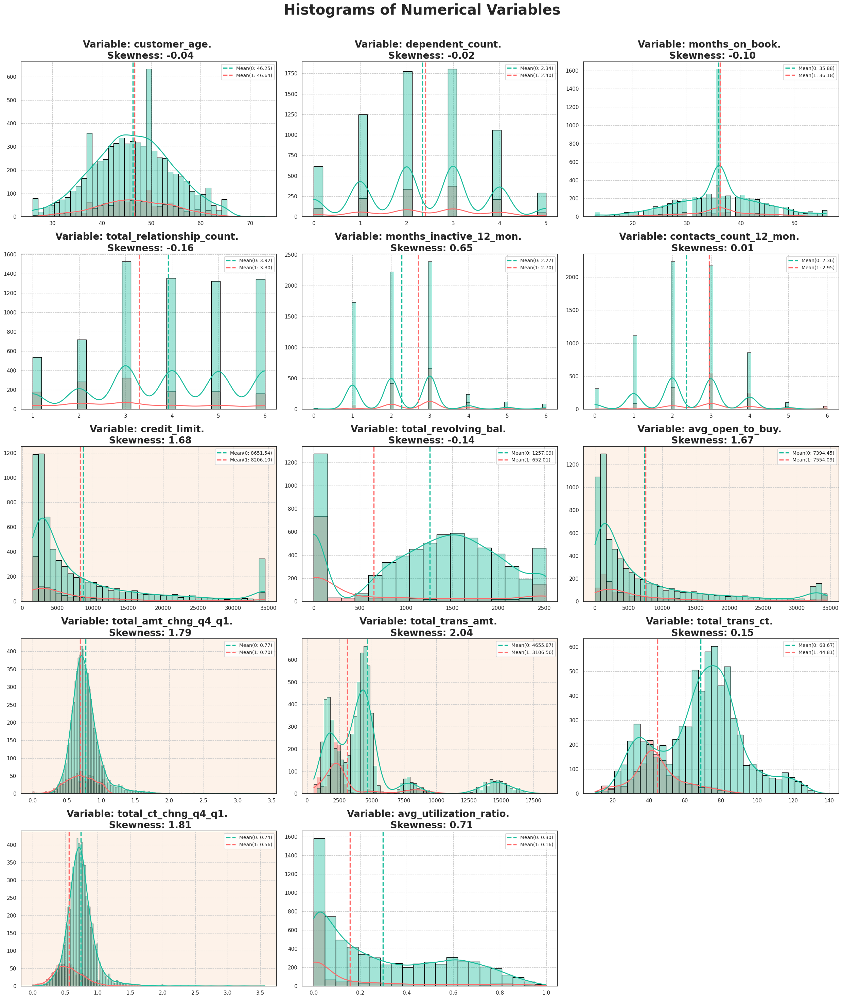
  <br />
  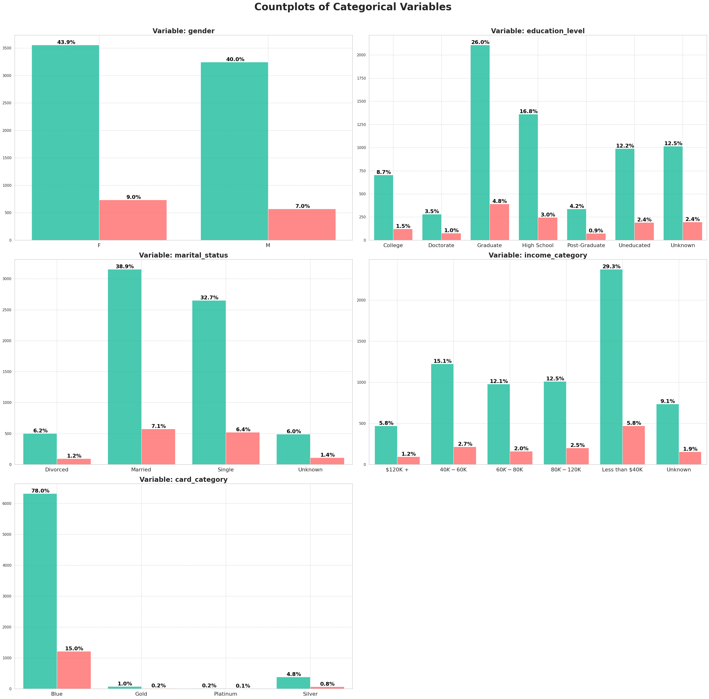
</div>
<br />

---

### 📉 Churn Rate — Training Data

<div align="center">
  
</div>
<br />

---

### 📈 Model Scores on Validation Data

<div align="left">
  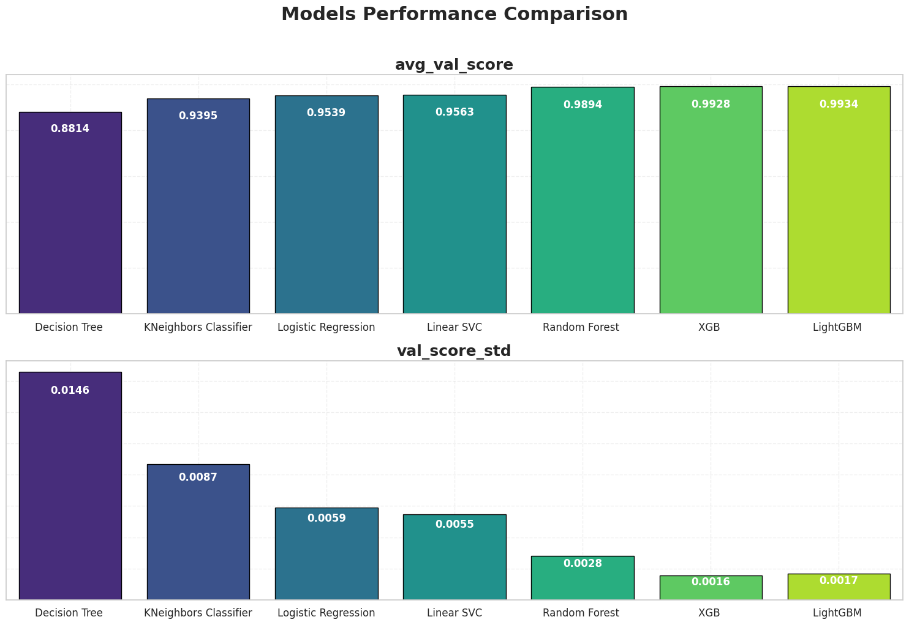
</div>
<br />

---

### 🧠 Final Model — Test Data Evaluation

<div align="center">
  
</div>
<br />

<div align="left">
  
</div>
<br />

<div align="left">
  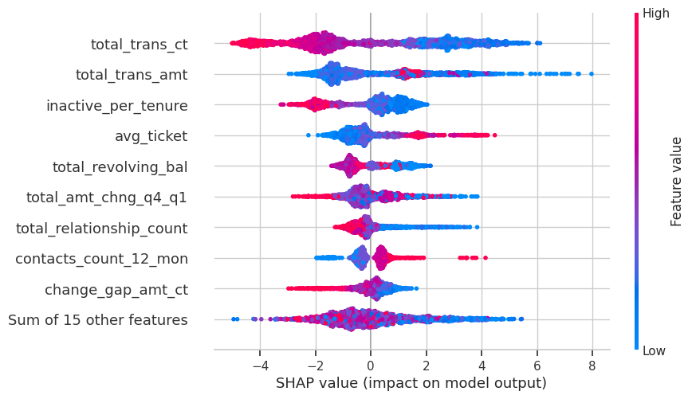
</div>
<br />

<p align="right">(<a href="#readme-top">back to top</a>)</p>

<br/>
<br/>

---

## Classification - Credit Risk Classification 💸

#### Project complete: [Click here to check the complete project](https://github.com/OtnielGomes/0_Portfolio-Credit_Risk_Analysis_with_Pytorch)

---

<div align="center">
  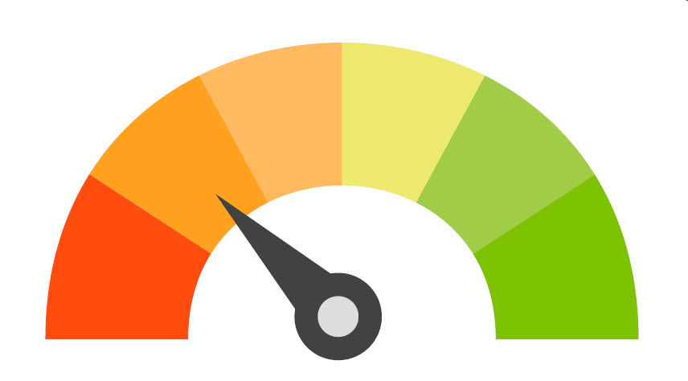
</div>

### 📃 Project Description

This project was developed in the **Azure Databricks** environment, using **neural networks and machine learning models** to predict whether a loan will be paid or defaulted.

The core of the solution is a **PyTorch model**, which serves as the foundation for a **4-level default risk classifier** that decides whether a loan should be **approved, denied, or sent for reassessment**.

The dataset comes from **Kaggle**, originally provided by **LendingClub**, a leading US peer-to-peer lending platform offering personal loans up to \$40,000.

---

### 🎯 Objectives

- Build a **machine learning model** capable of predicting default likelihood at the time of application.
- Use only **application-time variables** to prevent credit approval for high-risk borrowers.
- Generate **strategic insights** to help the institution reduce financial losses.

---

### ✅ Final Solution — Loan Risk Classification

| Risk Level | Description | Accuracy |
|---|---|---|
| ☑️ **Very Low Risk** | High repayment probability, eligible for lower rates | 66.89% |
| ✅ **Low Risk** | Likely repaid, requires careful evaluation | 66.89% |
| ⚠️ **Medium Risk** | Conditional approval or justified denial | 63.87% |
| 🔴 **Very High Risk** | Strong default probability — automatic rejection | 63.87% |

---

### 📈 Model Scores on Validation Data

<div align="left">
  
</div>
<br />

### 🧠 Final Model — Test Data

<div align="left">
  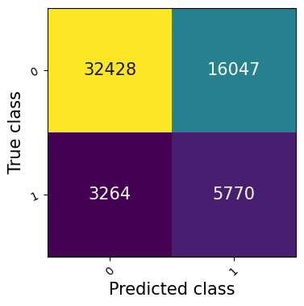
</div>
<br />

- **AUC-ROC**: 71.08%
- **Accuracy**: 66.42%
- **F1 Score**: 37.41%
- **Recall**: 63.87%

### 💡 Final Classifier — Example Output


```print
This loan has a: 46.75% chance of defaulting
Loan approved! --- Very low default risk loan

This loan has been deemed very low risk because some of the scores below meet the criteria required for loan approval.

expen_cr_inc: D >>>> Not OK
score_cr: 716.67 >>>> OK
ability_to_pay: 11.26 >>>> Not OK
dti: 27.65 >>>> Not OK

### sub_grade ###: B2 >>>> OK
```


<p align="right">(<a href="#readme-top">back to top</a>)</p>

<br/>
<br/>

---

### Clustering Project

#### Under construction...

<br />
<div align="center">
  
</div>
<br/>

<p align="right">(<a href="#readme-top">back to top</a>)</p>

---

## Contributing

Contributions are what make the open source community such an amazing place to learn, inspire, and create. Any contributions you make are **greatly appreciated**.

<p align="right">(<a href="#readme-top">back to top</a>)</p>

### Top contributors:

<a href="https://github.com/OtnielGomes/Portifolio--AI-Engineering--Data-Science/graphs/contributors">
  
</a>

---

## License

Distributed under the MIT License. See [`LICENSE.txt`](https://github.com/OtnielGomes/Portifolio--AI-Engineering--Data-Science/blob/main/LICENSE) for more information.

<p align="right">(<a href="#readme-top">back to top</a>)</p>

---

## Contact

[![LinkedIn][linkedin-shield]][linkedin-url]

<p align="right">(<a href="#readme-top">back to top</a>)</p>

---


[author-shield]: https://img.shields.io/badge/author-OtnielGomes-red.svg
[author-url]: https://github.com/OtnielGomes

[linkedin-shield]: https://img.shields.io/badge/-LinkedIn-black.svg?style=for-the-badge&logo=linkedin&colorB=555
[linkedin-url]: https://linkedin.com/in/otnielgomes

