<a id="readme-top"></a>

[![author][author-shield]][author-url]
# AI Engineer Portfolio

[](https://www.python.org/)
[](https://www.langchain.com/)
[](https://ollama.com/)
[](https://www.trychroma.com/)
[](https://docs.ragas.io/)
[](https://smith.langchain.com/)
[](https://pytorch.org)
[](https://huggingface.co/)
[](https://github.com/OtnielGomes/Portifolio--AI-Engineering--Data-Science/blob/main/LICENSE)
[](https://linkedin.com/in/otnielgomes)

<br />
<div align="center">
  <a href="https://github.com/OtnielGomes/Portifolio--AI-Engineering--Data-Science">
    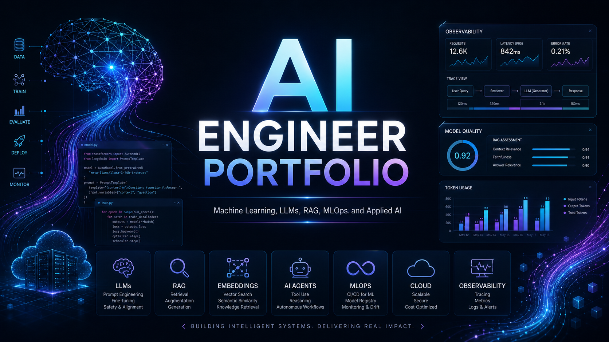
  </a>

<h1 align="center">Welcome to my AI Engineer Portfolio!</h1>
</div>

I build and evaluate **LLM-powered systems** — RAG pipelines, multi-agent assistants, and benchmark frameworks — with measurable quality, latency, and observability.

Open to **AI Engineering, LLM Systems, and applied Generative AI** roles and collaborations.

| Focus area | Skills |
|---|---|
| **AI Engineering** | LangGraph agents, RAG (Naive, HyDE, Reranking), FastAPI, Streamlit, Docker |
| **Evaluation & Observability** | RAGAS, BLEU, ROUGE, LLM-as-Judge, LangSmith tracing |
| **Data & Modeling** | CRISP-DM, scikit-learn, XGBoost, LightGBM, PyTorch, Azure Databricks |

---

## Project Index

| Project | Problem | Stack | Key result |
|---|---|---|---|
| [AI Agent with Docker](#ai-agent-with-docker-containers-and-python-) | Automate email research, inbox reading, and sending | LangGraph, FastAPI, PostgreSQL, Docker | Deployed on DigitalOcean App Platform |
| [LLM-Eval-Suite](#llm-eval-suite-) | Compare LLMs and RAG strategies objectively | Ollama, ChromaDB, RAGAS, LangSmith | **0.988** composite RAGAS (HyDE, Gemma3 27B) |
| [Document RAG Agent](#llms---document-rag-agent-) | Q&A over PDF documents with grounded answers | LangChain, ChromaDB, Streamlit, PyMuPDF | Context-aware answers with latency tracking |
| [Churn Prediction](#classification---credit-card-churn-prediction-) | Identify credit-card customers at risk of leaving | XGBoost, LightGBM, scikit-learn | End-to-end CRISP-DM pipeline with SHAP explainability |
| [Credit Risk Classification](#classification---credit-risk-classification-) | Classify loan default risk at application time | PyTorch, Azure Databricks | **71.08%** AUC-ROC on test data |
| [Clustering Project](#clustering-project-) | Customer segmentation (planned) | scikit-learn, CRISP-DM | In progress |

---

<!-- TABLE OF CONTENTS -->
<details>
  <summary>Table of Contents</summary>
  <ol>
    <li><a href="#project-index">Project Index</a></li>
    <li>
      <strong>AI Engineering Projects</strong>
      <ul>
        <li><a href="#ai-agent-with-docker-containers-and-python-">AI Agent with Docker</a></li>
        <li><a href="#llm-eval-suite-">LLM-Eval-Suite</a></li>
        <li><a href="#llms---document-rag-agent-">Document RAG Agent</a></li>
      </ul>
    </li>
    <li>
      <strong>Data Science Projects</strong>
      <ul>
        <li><a href="#classification---credit-card-churn-prediction-">Credit Card Churn Prediction</a></li>
        <li><a href="#classification---credit-risk-classification-">Credit Risk Classification</a></li>
        <li><a href="#clustering-project-">Clustering Project</a></li>
      </ul>
    </li>
    <li><a href="#about">About</a></li>
    <li><a href="#license">License</a></li>
    <li><a href="#contact">Contact</a></li>
  </ol>
</details>

<br />

## AI Engineering Projects

---

## AI-Agent-with-Docker-Containers-and-Python 🤖

[](https://www.langchain.com/langgraph)
[](https://fastapi.tiangolo.com/)
[](https://www.docker.com/)
[](https://www.postgresql.org/)
[](https://streamlit.io/)

**Repository:** [AI-Agent-with-Docker-Containers-and-Python](https://github.com/OtnielGomes/AI-Agent-with-Docker-Containers-and-Python)

<div align="center">
  <a href="https://github.com/OtnielGomes/AI-Agent-with-Docker-Containers-and-Python">
    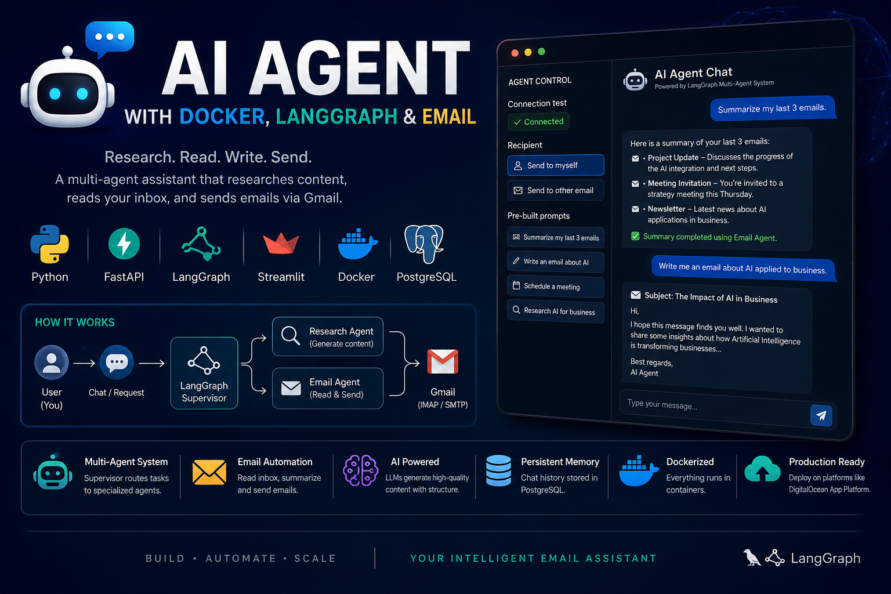
  </a>
</div>

**Problem:** Manual email workflows — researching topics, reading the inbox, and drafting replies — are slow and repetitive.

**Solution:** A **LangGraph multi-agent** assistant with a supervisor routing tasks to research and email workers. **FastAPI** handles the API, **PostgreSQL** stores chat history, **Streamlit** provides the UI, and **Docker Compose** packages everything for local and cloud deployment.

**Result:** End-to-end assistant deployed on **DigitalOcean App Platform**, capable of summarizing inbox messages and sending structured emails via Gmail.

### Architecture

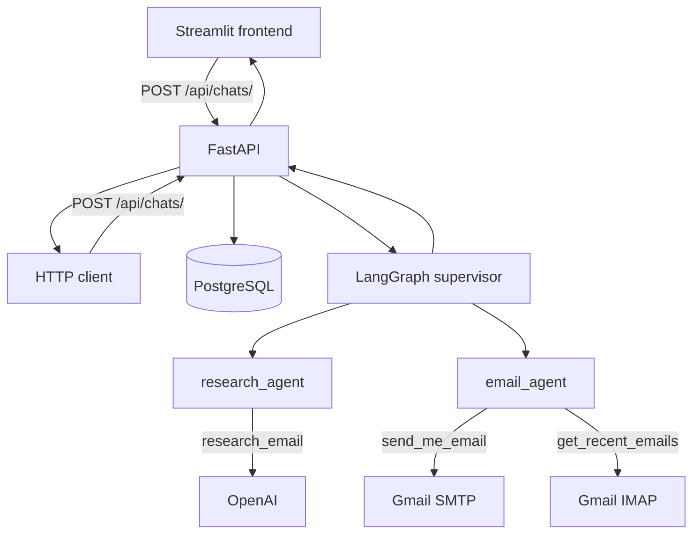
```mermaid
flowchart TB
    UI[Streamlit frontend] -->|POST /api/chats/| API[FastAPI]
    Client[HTTP client] -->|POST /api/chats/| API
    API --> DB[(PostgreSQL)]
    API --> Supervisor[LangGraph supervisor]
    Supervisor --> Research[research_agent]
    Supervisor --> Email[email_agent]
    Research -->|research_email| LLM[OpenAI]
    Email -->|send_me_email| SMTP[Gmail SMTP]
    Email -->|get_recent_emails| IMAP[Gmail IMAP]
    Supervisor --> API
    API --> UI
    API --> Client
```

| Layer | Technology | Responsibility |
|-------|------------|----------------|
| API | FastAPI, uvicorn | HTTP routes, validation, persistence |
| Agents | LangGraph, langgraph-supervisor | Supervisor + workers (research, email) |
| LLM | langchain-openai | Structured email generation |
| Email | smtplib, IMAP | Send and read via Gmail |
| Database | SQLModel, PostgreSQL | Chat message history |
| UI | Streamlit | Chat, recipient settings, prompts |
| Containers | Docker Compose | Local orchestration and production base |

<details>
<summary>View demos, deployment, and observability</summary>

#### Agent interface

Sidebar with connection test, recipient choice (*send to myself* or *other email*), and pre-built prompts.

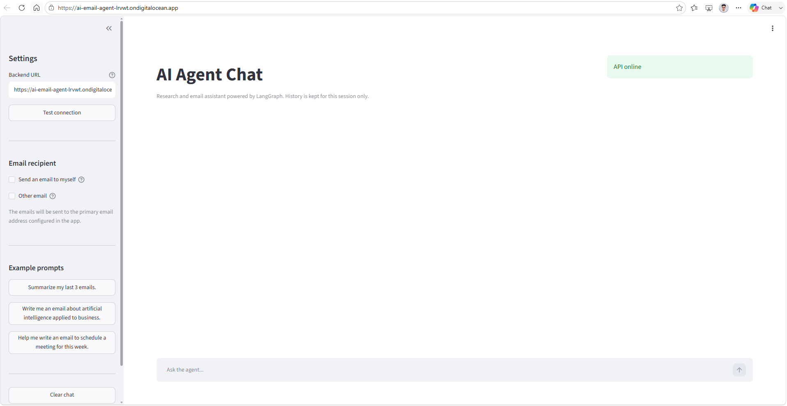

#### Summarize recent emails

Request: *"Summarize my last 3 emails."* — the agent reads the inbox and returns a structured summary.

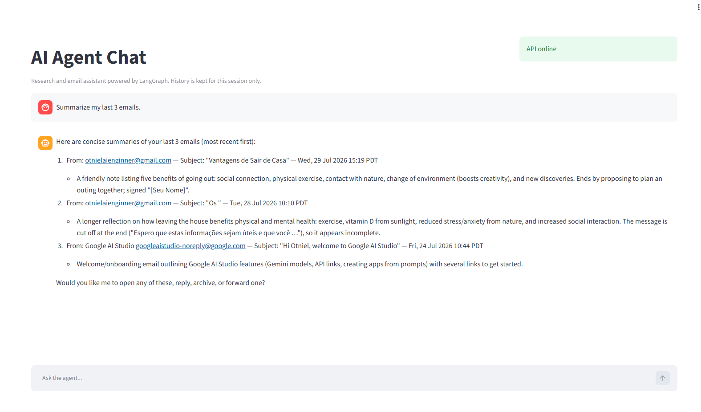

#### Schedule a meeting by email

Request: *"Help me write an email to schedule a meeting for this week."*

<table>
  <tr>
    <td width="50%">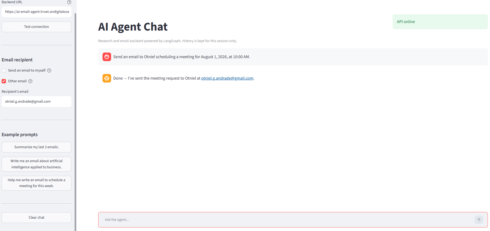</td>
    <td width="50%">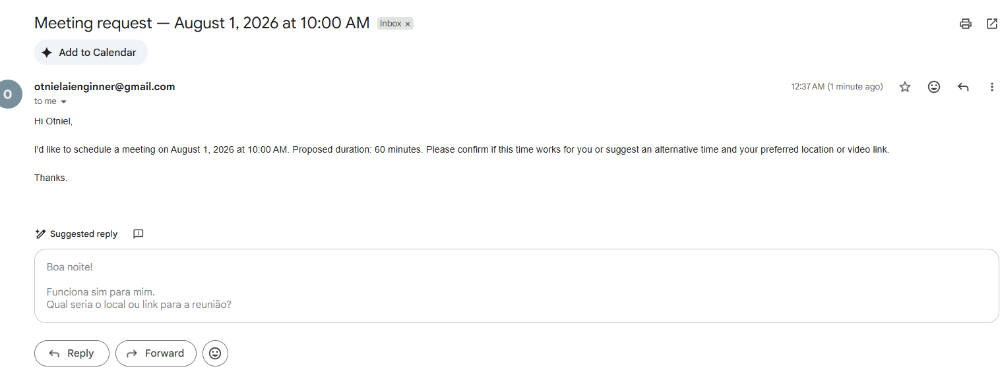</td>
  </tr>
</table>

#### Email about Artificial Intelligence

Request: *"Write me an email about artificial intelligence applied to business."*

<table>
  <tr>
    <td width="50%">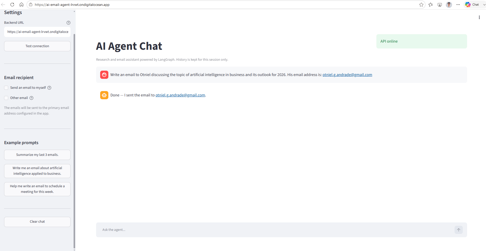</td>
    <td width="50%">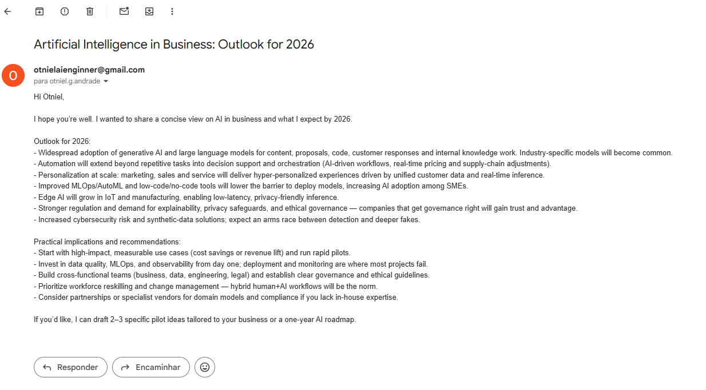</td>
  </tr>
</table>

#### Deployment on DigitalOcean

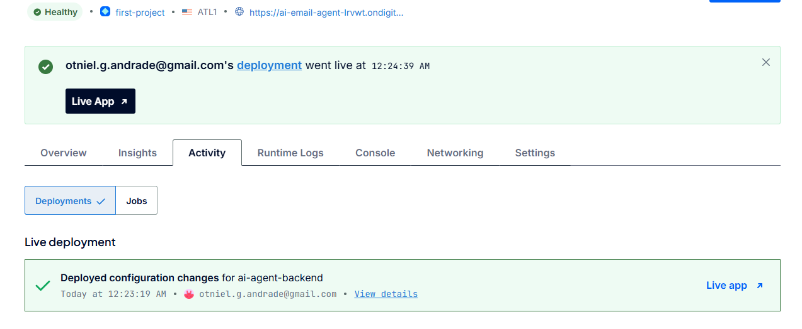

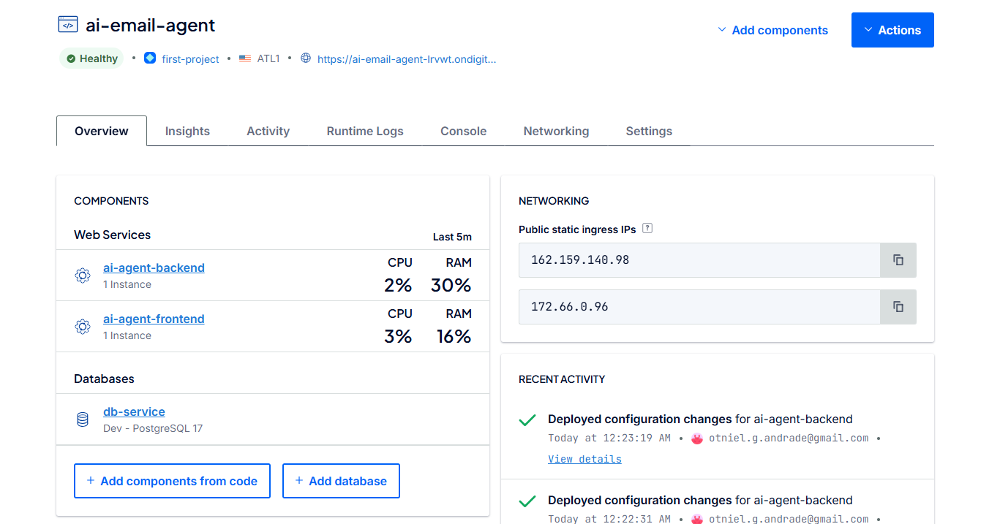

#### Runtime logs

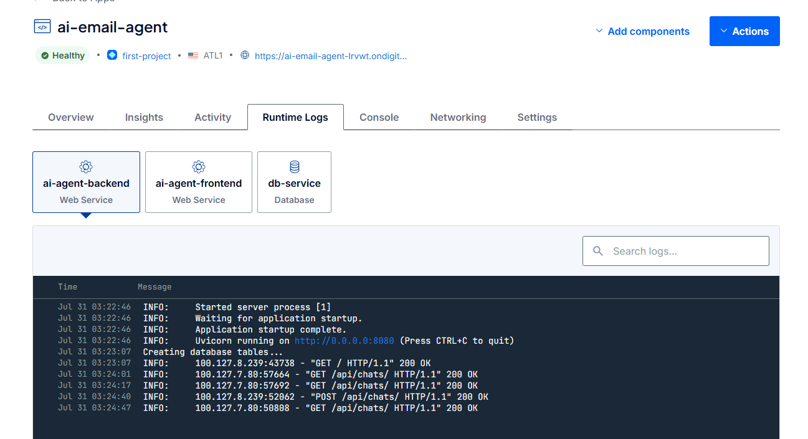

</details>

<p align="right">(<a href="#readme-top">back to top</a>)</p>

---

## LLM-Eval-Suite 🧪

[](https://ollama.com/)
[](https://www.trychroma.com/)
[](https://docs.ragas.io/)
[](https://smith.langchain.com/)

**Repository:** [LLM-Eval-Suite](https://github.com/OtnielGomes/LLM-Eval-Suite)

<div align="center">
  <a href="https://github.com/OtnielGomes/LLM-Eval-Suite">
    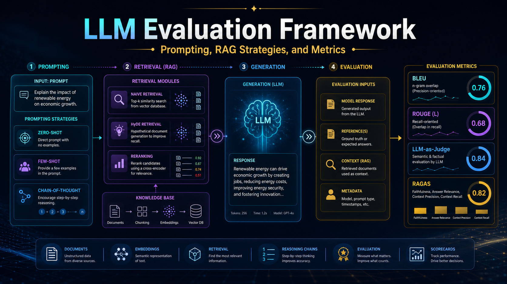
  </a>
</div>

**Problem:** Choosing the right LLM and RAG strategy requires systematic comparison — ad-hoc testing is not reproducible or measurable.

**Solution:** A benchmark framework comparing **prompting strategies** (Zero-Shot, Few-Shot, CoT) and **RAG retrieval strategies** (Naive, HyDE, Reranking) with BLEU, ROUGE, LLM-as-Judge, and RAGAS — all traced via **LangSmith**.

**Result:** **0.988** composite RAGAS score with HyDE on Gemma3 27B; **89.3%** mean accuracy with Qwen3-Coder 480B across prompting strategies.

### Architecture

| Component | Backend | Model | Purpose |
|---|---|---|---|
| Generation | Ollama Cloud | Configurable via `.env` | Answer generation |
| Embeddings | Ollama Local | `nomic-embed-text` | Document & query embeddings |
| Judge | Ollama Cloud | Configurable via `.env` | LLM-as-Judge scoring |
| Vector Store | Local | ChromaDB | Document retrieval |

### Results — Prompting Accuracy


| Model | Zero-Shot | Few-Shot | CoT | Mean |
|---|---|---|---|---|
| **Qwen3-Coder 480B** | 90% | 88% | 90% | **89.3%** |
| Gemma3 27B | 68% | 64% | 88% | 73.3% |
| GPT-OSS 20B | 0% | 4% | 8% | 4% |

### Results — RAG Composite RAGAS Score


| Model | Naive | HyDE | Reranking | Mean |
|---|---|---|---|---|
| **Gemma3 27B** | 0.968 | **0.988** | 0.969 | **0.975** |
| Qwen3-Coder 480B | 0.971 | 0.973 | 0.922 | 0.955 |
| GPT-OSS 20B | 0.651 | 0.000 | 0.653 | 0.435 |

### Results — Latency


<details>
<summary>View detailed benchmark charts</summary>

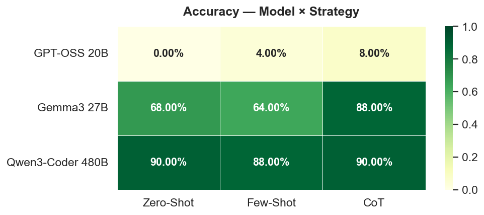

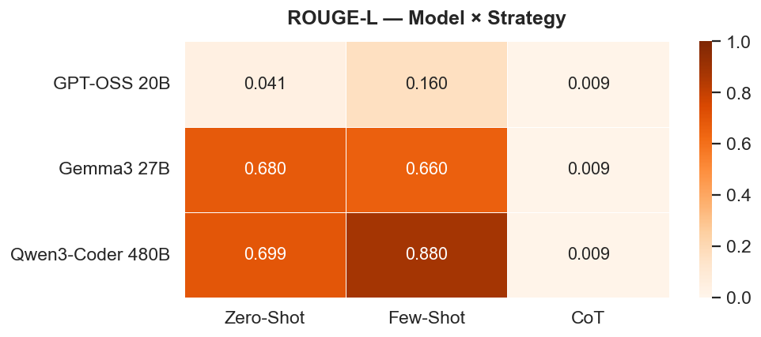


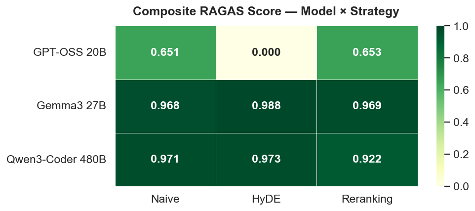


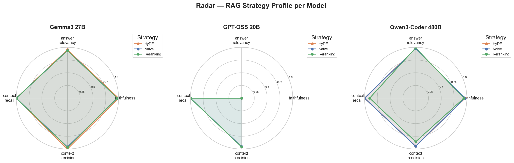

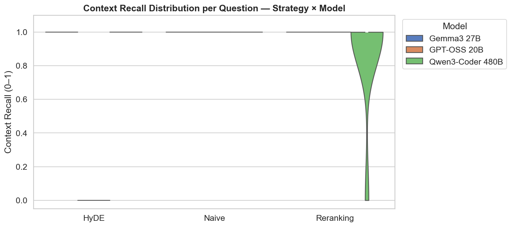

</details>

<p align="right">(<a href="#readme-top">back to top</a>)</p>

---

## LLMs - Document RAG Agent 🗂️

[](https://www.langchain.com/)
[](https://streamlit.io/)
[](https://www.trychroma.com/)

**Repository:** [Document-Rag-Agent](https://github.com/OtnielGomes/Document-Rag-Agent)

<div align="center">
  <a href="https://github.com/OtnielGomes/Document-Rag-Agent">
    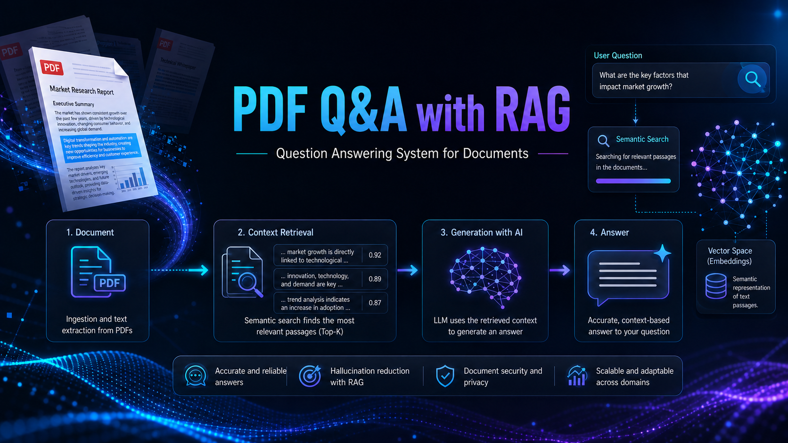
  </a>
</div>

**Problem:** Finding accurate answers inside long PDF documents is slow when relying on manual search or unconstrained LLM responses.

**Solution:** A **RAG-based Q&A system** with PDF ingestion, text chunking, semantic search via **ChromaDB**, and context-aware generation through **LangChain** and **Streamlit**, with prompt rules to reduce hallucinations.

**Result:** Grounded answers from uploaded PDFs (tested with a resume as knowledge base), with manual evaluation of accuracy and application latency.

### Architecture

| Stage | Technology | Purpose |
|---|---|---|
| Ingestion | PyMuPDF | Extract text from PDF uploads |
| Chunking & embedding | LangChain, ChromaDB | Split documents and store vectors |
| Generation | LLM via LangChain | Context-aware answer synthesis |
| Interface | Streamlit | Upload, query, and review metrics |

[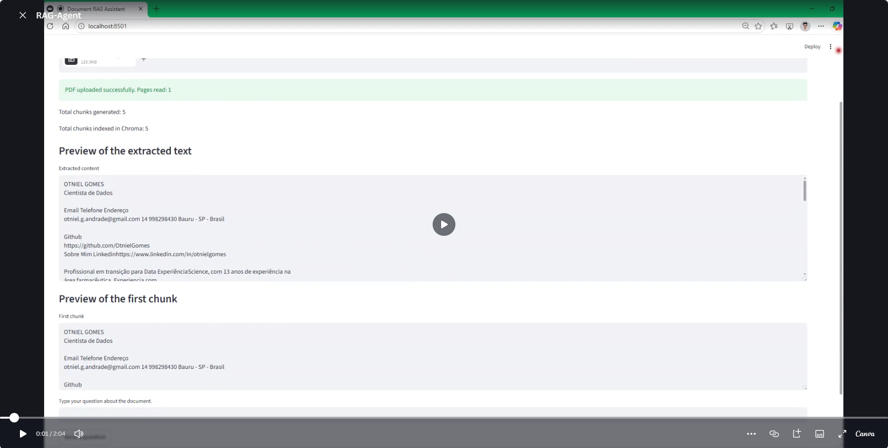](https://canva.link/zjmai0hdpe9v8lf)

<details>
<summary>View application screenshots</summary>

#### Loading PDF

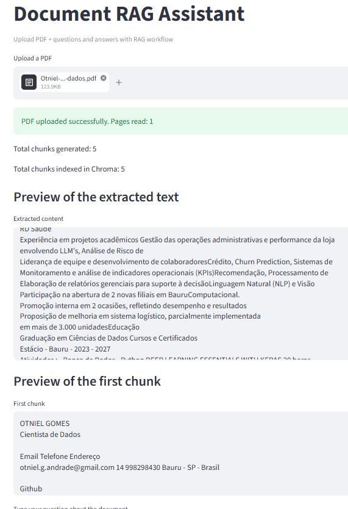

#### Asking the agent

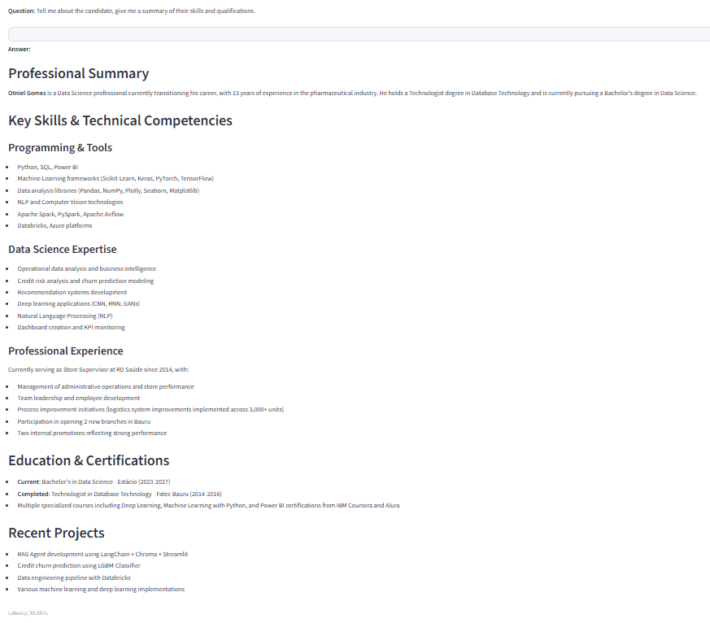

#### Latency and metrics

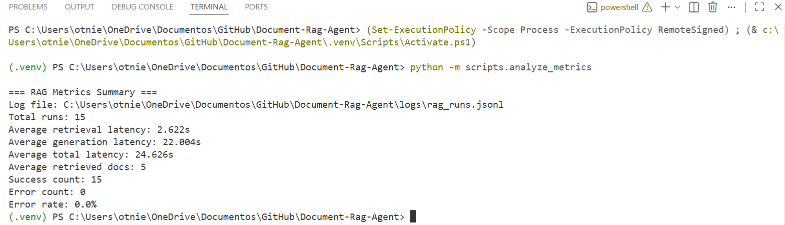

</details>

<p align="right">(<a href="#readme-top">back to top</a>)</p>

---

## Data Science Projects

---

## Classification - Credit Card Churn Prediction 💳

[](https://scikit-learn.org/)
[](https://xgboost.ai/)
[](https://lightgbm.readthedocs.io/)

**Repository:** [Churn-Prediction-Credit-Card](https://github.com/OtnielGomes/Churn-Prediction-Credit-Card)

<div align="center">
  <a href="https://github.com/OtnielGomes/Churn-Prediction-Credit-Card">
    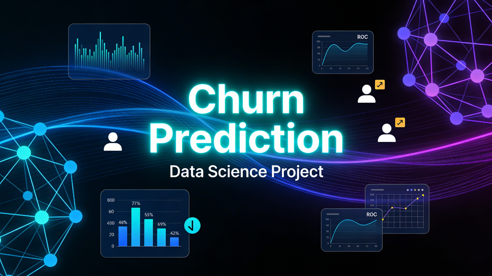
  </a>
</div>

**Problem:** A banking institution loses revenue when credit-card customers churn without early warning.

**Solution:** End-to-end **CRISP-DM** pipeline — EDA, feature engineering, and comparison of Logistic Regression, SVM, KNN, Random Forest, XGBoost, and LightGBM with stratified splits and calibration analysis.

**Result:** Production-ready artifact (`joblib`) delivering a high-risk customer list for targeted retention campaigns, with SHAP-based explainability.

### CRISP-DM Methodology

| **Stage** | **Objective** | **Methodological Execution** |
| :--- | :--- | :--- |
| **1. Business Understanding** | Mitigate revenue loss by identifying at-risk customers. | • **Target Definition**: Binary Classification (Churn: Yes/No).<br>• **KPIs**: Maximize **Lift** in retention campaigns & Revenue Saved vs. Cost. |
| **2. Data Understanding** | Detect patterns of friction and dissatisfaction. | • **EDA**: Distribution analysis (Detect Imbalance).<br>• **Hypothesis Testing**: Correlation Matrix & Independence Tests (Chi-Square). |
| **3. Data Preparation** | Construct a robust dataset for parametric modeling. | • **Scaling**: Standardization (Z-score).<br>• **Encoding**: One-Hot Encoding.<br>• **Splitting**: Stratified Train/Test Split. |
| **4. Modeling** | Estimate Churn Probability. | • **Algorithms**: Logistic Regression, SVM LinearSVC, KNN, Random Forest, XGBoost, LightGBM. |
| **5. Evaluation** | Assess model reliability and financial impact. | • **Metrics**: AUC-ROC, F1-Score, Recall, Calibration Curve. |
| **6. Deployment** | Integrate insights into the CRM lifecycle. | • **Deliverable**: High-Risk Customer List for Marketing Squad.<br>• **Artifact**: Serialized model (`joblib`) for batch inference. |

### Final Model — Test Data

<div align="center">
  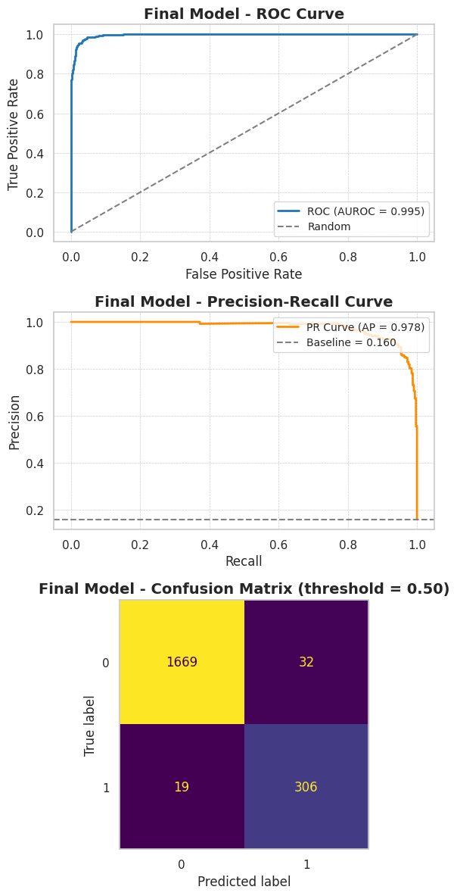
</div>

<details>
<summary>View EDA, model comparison, and explainability</summary>

#### Numerical & categorical variables

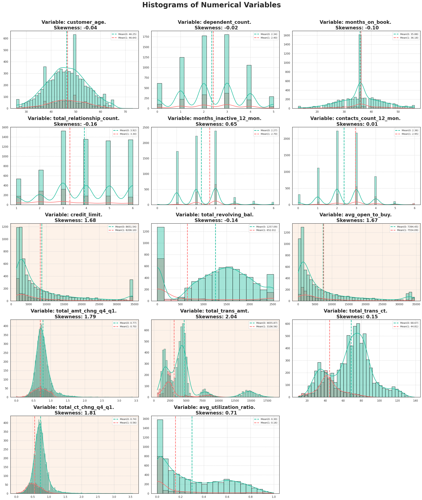
<br />
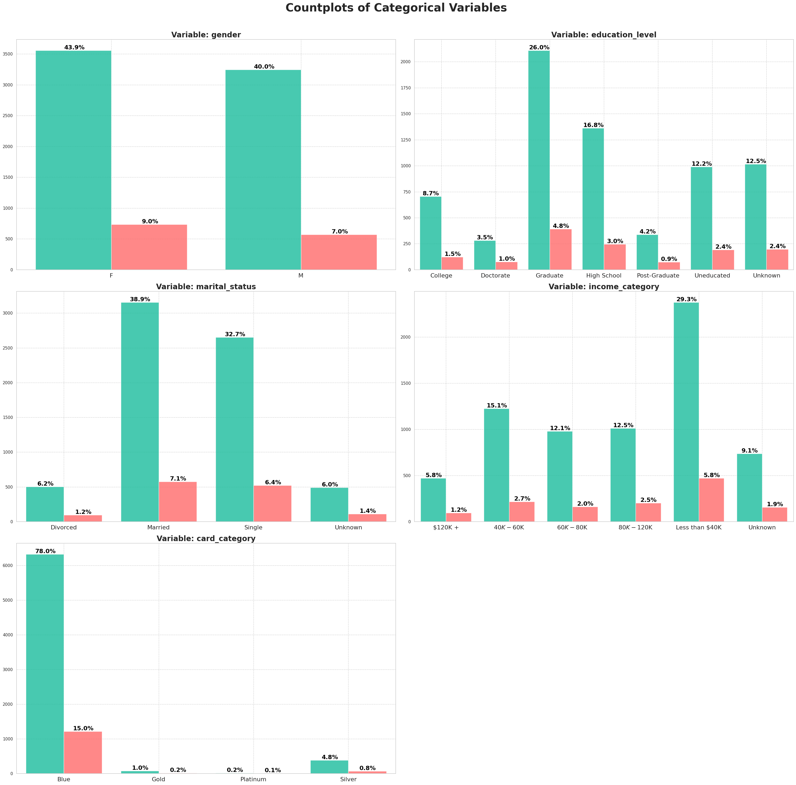

#### Churn rate — training data

<div align="center">
  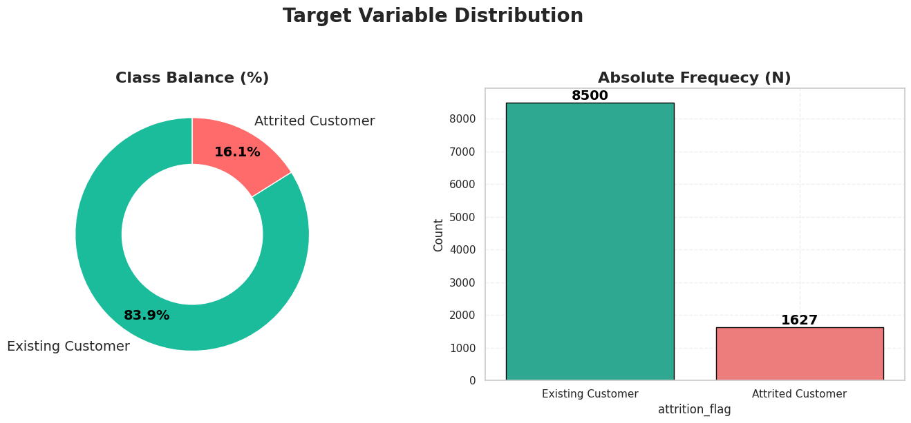
</div>

#### Model scores on validation data

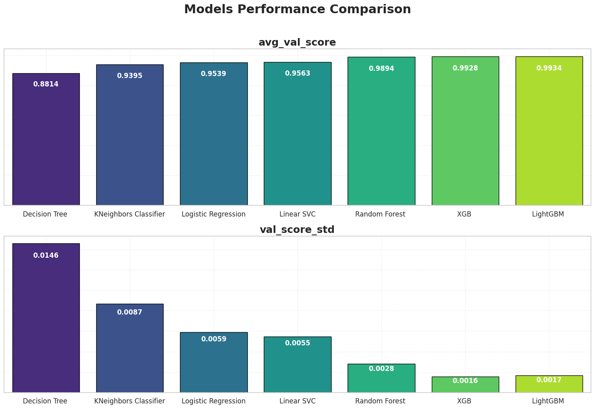

#### Probability distribution & SHAP

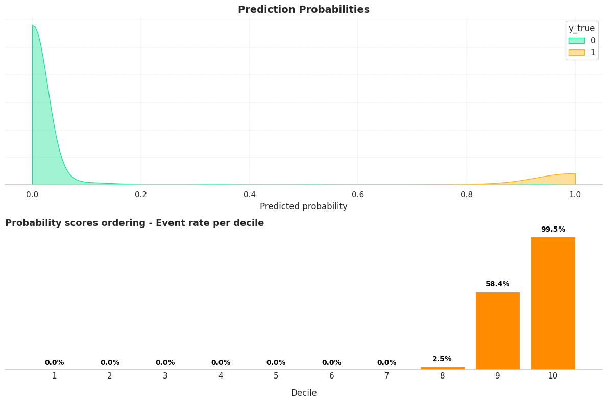
<br />
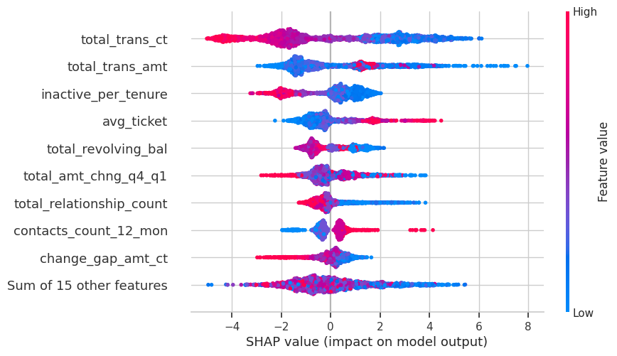
<br />
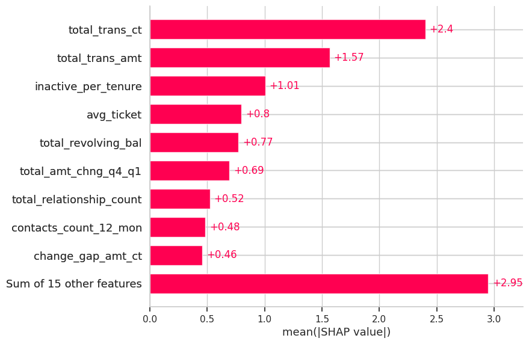

#### Correlation analysis

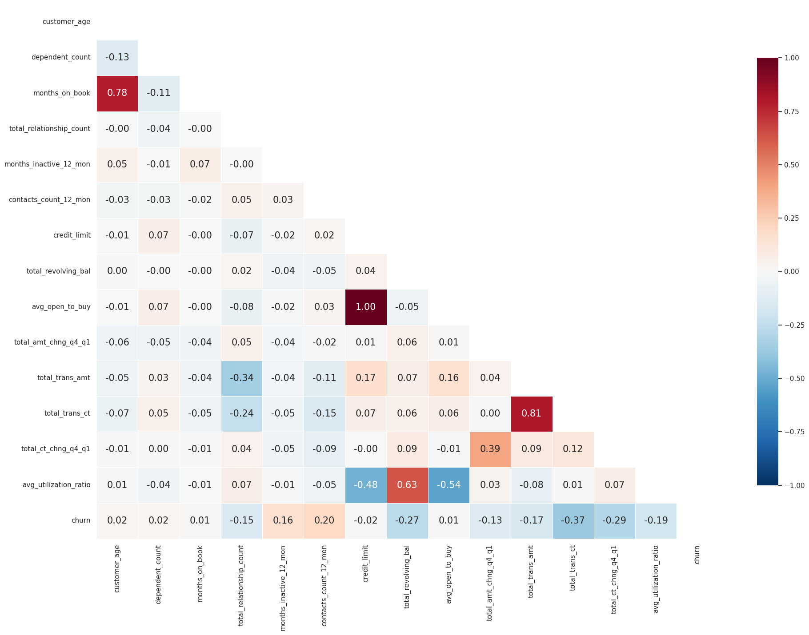

#### Deployment artifacts

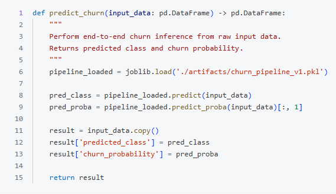
<br />
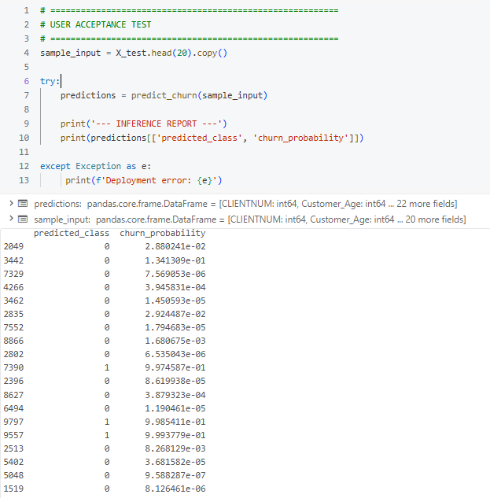

</details>

<p align="right">(<a href="#readme-top">back to top</a>)</p>

---

## Classification - Credit Risk Classification 💸

[](https://pytorch.org/)
[](https://azure.microsoft.com/)

**Repository:** [0_Portfolio-Credit_Risk_Analysis_with_Pytorch](https://github.com/OtnielGomes/0_Portfolio-Credit_Risk_Analysis_with_Pytorch)

<div align="center">
  <a href="https://github.com/OtnielGomes/0_Portfolio-Credit_Risk_Analysis_with_Pytorch">
    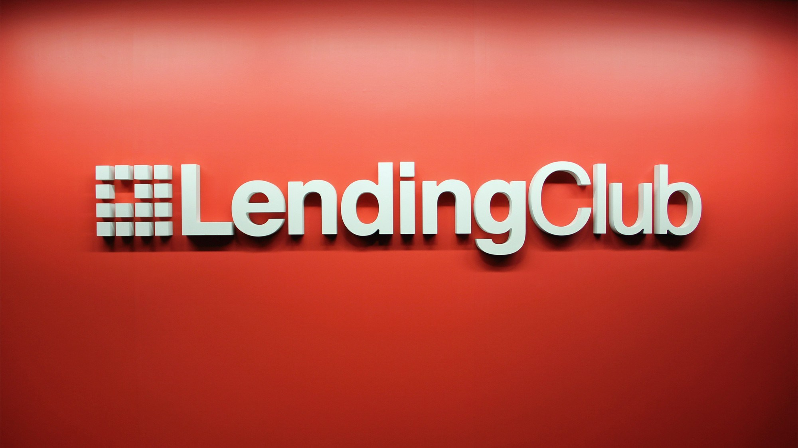
  </a>
</div>

**Problem:** Lending institutions need to assess default risk at loan application time using only information available before approval.

**Solution:** A **PyTorch neural network** trained on LendingClub data in **Azure Databricks**, combined with a **4-level risk classifier** that routes loans to approval, denial, or reassessment.

**Result:** **71.08% AUC-ROC**, **66.42% accuracy**, and **63.87% recall** on test data.

### Risk Classification Levels

| Risk Level | Description |
|---|---|
| **Very Low Risk** | High repayment probability, eligible for lower rates |
| **Low Risk** | Likely repaid, requires careful evaluation |
| **Medium Risk** | Conditional approval or justified denial |
| **Very High Risk** | Strong default probability — automatic rejection |

> **Note:** Per-class accuracy values in the original analysis should be verified against the [source repository](https://github.com/OtnielGomes/0_Portfolio-Credit_Risk_Analysis_with_Pytorch) — some class-level metrics share identical values and may reflect grouping rather than distinct scores.

### Test Data Metrics

| Metric | Value |
|---|---|
| **AUC-ROC** | 71.08% |
| **Accuracy** | 66.42% |
| **F1 Score** | 37.41% |
| **Recall** | 63.87% |

<div align="left">
  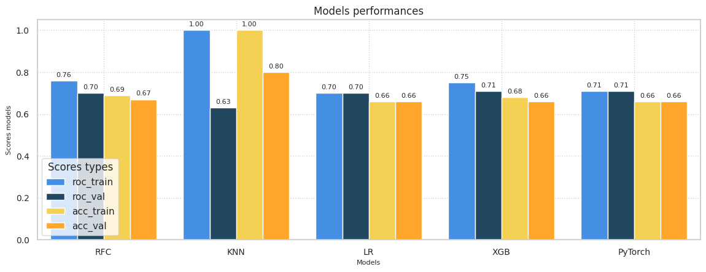
</div>

<div align="left">
  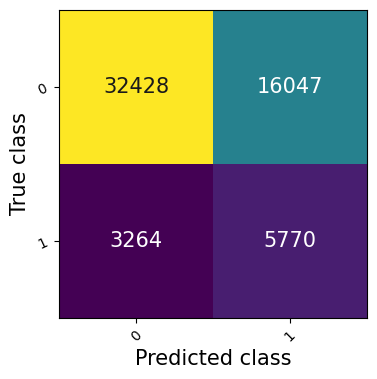
</div>

### Example Classifier Output

```text
This loan has a: 46.75% chance of defaulting
Loan approved! --- Very low default risk loan

This loan has been deemed very low risk because some of the scores below meet the criteria required for loan approval.

expen_cr_inc: D >>>> Not OK
score_cr: 716.67 >>>> OK
ability_to_pay: 11.26 >>>> Not OK
dti: 27.65 >>>> Not OK

### sub_grade ###: B2 >>>> OK
```

<details>
<summary>View additional assets</summary>

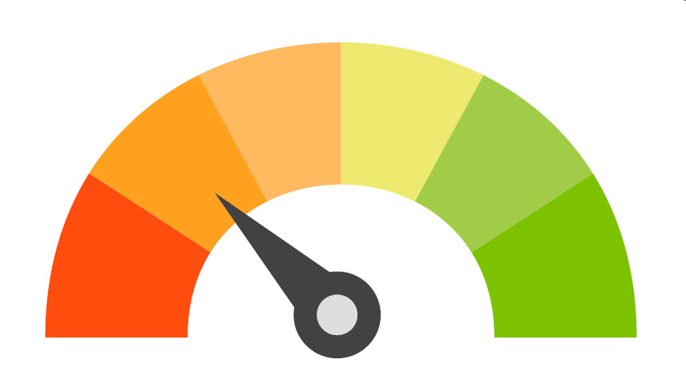

</details>

<p align="right">(<a href="#readme-top">back to top</a>)</p>

---

## Clustering Project 📊

[](https://scikit-learn.org/)

**Problem:** Customer segmentation helps businesses tailor products and retention strategies — this project will apply unsupervised learning to discover natural groupings in customer data.

**Solution:** Planned **CRISP-DM** workflow with EDA, feature scaling, and clustering algorithms (K-Means, hierarchical clustering, and evaluation via silhouette score).

**Result:** *In progress* — repository and full analysis coming soon.

<div align="center">
  
</div>

<p align="right">(<a href="#readme-top">back to top</a>)</p>

---

## About

This repository is a **showcase portfolio** documenting my learning journey in **AI Engineering** (primary focus) and **Data Science** (complementary study area). Each project links to its own GitHub repository with full source code, while this repo holds architecture diagrams, benchmark results, and demo media.

<p align="right">(<a href="#readme-top">back to top</a>)</p>

---

## License

Distributed under the MIT License. See [`LICENSE`](https://github.com/OtnielGomes/Portifolio--AI-Engineering--Data-Science/blob/main/LICENSE) for more information.

<p align="right">(<a href="#readme-top">back to top</a>)</p>

---

## Contact

[![LinkedIn][linkedin-shield]][linkedin-url]
[![GitHub][github-shield]][github-url]

**Otniel Gomes** — AI Engineer

- GitHub: [@OtnielGomes](https://github.com/OtnielGomes)
- LinkedIn: [linkedin.com/in/otnielgomes](https://linkedin.com/in/otnielgomes)

<p align="right">(<a href="#readme-top">back to top</a>)</p>

---

[author-shield]: https://img.shields.io/badge/author-OtnielGomes-red.svg
[author-url]: https://github.com/OtnielGomes

[linkedin-shield]: https://img.shields.io/badge/-LinkedIn-black.svg?style=for-the-badge&logo=linkedin&colorB=555
[linkedin-url]: https://linkedin.com/in/otnielgomes

[github-shield]: https://img.shields.io/badge/-GitHub-black.svg?style=for-the-badge&logo=github&colorB=555
[github-url]: https://github.com/OtnielGomes
